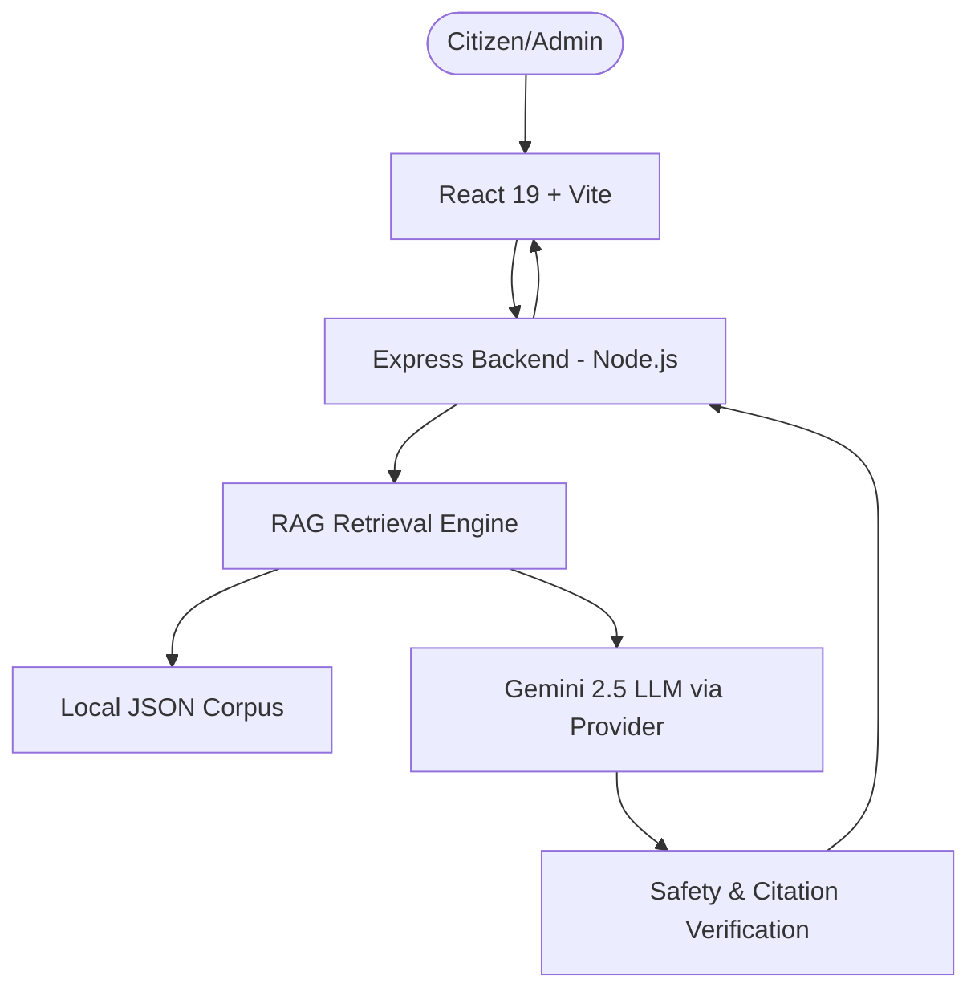

# 🏛️ CoopSathi AI

> **AI-powered Cooperative Governance & Citizen Services Assistant**

[](https://coopsathi.vercel.app)
[](https://www.sih.gov.in)
[]()

**⚠️ DISCLAIMER: This is a Smart India Hackathon (SIH) 2026 prototype built by Team HexYZ. It is NOT an official service of the Ministry of Cooperation, NCCT, or the Government of India. The legal citations, schemes, and statutory data presented are for demonstration purposes only.**

---

## 1. Problem Statement
**Problem Statement ID: 26088**
*“Multilingual Cooperative Governance & Legal Assistance Chatbot”*

India's cooperative sector spans over 8 lakh cooperative societies with 29 crore members, yet access to reliable, multilingual information regarding the MSCS Act 2023, PACS by-laws, PMFBY (Crop Insurance), and KCC loans remains fragmented. Citizens struggle with complex legal jargon and unverified scheme eligibility, while administrators lack unified grievance routing tools.

## 2. Solution
**CoopSathi AI** provides a unified AI-powered platform that acts as a bridge between citizens, PACS administrators, and government authorities. It offers an intelligent RAG (Retrieval-Augmented Generation) assistant that answers queries in 22 regional languages, a PMFBY premium estimator, and an end-to-end grievance tracking system.

## 3. Key Features
| Feature | Status | Description |
|---------|--------|-------------|
| **Multilingual AI Assistant** | **LIVE** | RAG-based query resolution in English, Hindi, and Marathi. |
| **Grounded Legal Citations** | **LIVE** | Answers based purely on retrieved MSCS Act/By-Laws data. |
| **Grievance Workflow** | **PROTOTYPE** | End-to-end grievance tracking saved to a local JSON database. |
| **PACS Admin Console** | **PROTOTYPE** | Dashboard for local secretaries to view queries and grievances. |
| **Authority Console** | **PROTOTYPE** | Aggregated view for district registrars to monitor escalations. |
| **PMFBY Estimator** | **PROTOTYPE** | Premium calculator using static 2026 Kharif/Rabi/Horticulture rates. |
| **Live Bhashini Integration** | **ROADMAP** | Expanding to all 22 scheduled Indian languages via Bhashini API. |
| **Real-time API Sync** | **ROADMAP** | Direct integration with Central Government scheme databases. |

## 4. Architecture
The project utilizes a Single Source of Truth architecture with a React frontend and a Node.js/Express backend. 



## 5. Live Demo
**[Launch CoopSathi Prototype](https://coopsathi.vercel.app)**

*Note: The Vercel deployment currently serves the frontend. To experience the full RAG backend, local setup is required.*

## 6. Screenshots
*(Placeholder for SIH Presentation Slides - Add screenshots of the Chat UI, PACS Admin, and Authority Console here)*

## 7. Technology Stack
- **Frontend:** React 19, Vite, Tailwind CSS, Lucide Icons
- **Backend:** Node.js, Express, TypeScript
- **Database (Prototype):** File-based JSON persistence (`grievancesDB.json`, `statutoryDatabase.json`)
- **LLM/RAG:** Google Gemini via `@google/generative-ai`, custom TF-IDF keyword retrieval engine

## 8. RAG Pipeline
Our Retrieval-Augmented Generation pipeline ensures absolute safety and legal accuracy:
1. **Query Normalization:** Filters out non-governmental/gibberish queries.
2. **Hybrid Retrieval:** Scores queries against the cooperative corpus.
3. **Safety Fallback:** If `maxScore < 20`, the system explicitly refuses to answer and escalates the query.
4. **Citation Validation:** Every generated answer is appended with its source ID.

## 9. Knowledge Sources
- **MSCS Act 2023**
- **PACS Model By-Laws**
- **PMFBY Guidelines (Prototype Rates)**
- **93+ Central Government Schemes**

## 10. Benchmark Methodology
We developed a strict 50-question dataset (`benchmarks/questions.json`) mapping queries to expected keywords and refusal triggers (e.g., out-of-domain queries, insufficient evidence).
- **Run Command:** `npm run benchmark`
- **Measures:** Accurate keyword retrieval, correct out-of-domain refusals, and low-confidence escapes.

## 11. Security
- **Strict CORS:** Frontend securely sandboxed.
- **Secret Management:** `GEMINI_API_KEY` is isolated entirely in the Node.js backend.
- **Rate Limiting & Helmet:** Implemented on all Express API routes.

## 12. Deployment
```bash
# 1. Clone the repository
git clone https://github.com/ayushpatil1001/CoopSathi.git
cd CoopSathi

# 2. Install dependencies & build
npm install
npm run build

# 3. Start the application (Frontend port 5173, Backend port 5000)
npm run dev
```

## 13. Environment Variables
Copy `backend/.env.example` to `backend/.env` and configure:
```env
PORT=5000
NODE_ENV=development
GEMINI_API_KEY=your_google_ai_studio_key
ALLOWED_ORIGINS=http://localhost:5173
```

## 14. API Documentation
- `POST /api/chat` - RAG Query Resolution
- `POST /api/pmfby/calculate` - Prototype Premium Estimator
- `POST /api/grievances` - Create Grievance
- `GET /api/grievances/:id` - Track Grievance Status
- `GET /api/health` - System Status

## 15. Demo Flow
For SIH Evaluators:
1. Select **Marathi** from the language dropdown.
2. Ask a legal question: *"What is Section 29?"* -> See retrieved source.
3. Ask a PMFBY question -> Calculate premium using the Prototype tool.
4. File a grievance -> Receive a tracking ID (`COOP-2026-MH-...`).
5. Open **PACS Admin** (`/pacs-admin`) -> View the submitted grievance.
6. Open **Authority Console** (`/authority`) -> View aggregated regional data.

## 16. Limitations
- **API Rate Limits:** The benchmark script may hit HTTP 429 Too Many Requests errors if executed against free-tier LLM API keys.
- **Persistence:** Grievances are saved to a local `.json` file rather than a production PostgreSQL cluster.

## 17. Roadmap
- Live Bhashini integration for 22 scheduled languages.
- Integration with Central Government API endpoints for live scheme data.
- Supabase Vector Store migration for semantic search.

## 18. Disclaimer
CoopSathi is an independent prototype. We do not claim any official affiliation with the Government of India. The tool should not be interpreted as professional legal advice.
